# Algorithms Laboratory Project: Class Routine Scheduler

This project is part of the CSE 2203: Algorithms Laboratory, a core course in the second year, second term of the CSE curriculum at Khulna University. The primary objective of this course is to translate algorithmic theory into practice through hands-on implementation. As a requirement of the course, this project focuses on solving a real-world constraint satisfaction problem — class routine scheduling — using algorithmic strategies such as backtracking, greedy methods, and recursive conflict resolution. It not only reinforces the theoretical concepts learned in CSE 2201 (Algorithms) but also contributes to key course learning outcomes by applying them in the design of a fully functional software tool.

**Course Code:** 0714 02 CSE 2203  
**Course Title:** Algorithms Laboratory  
**Instructor:** Sajib Chatterjee, Lecturer  
**Discipline:** Computer Science and Engineering  
**Institution:** Khulna University, Khulna  
**Year:** 2  
**Term:** 2

## 🧑‍🤝‍🧑 Team Members

- **Sohana Rahman Tuly** (Student ID: 230217)  
- **Toma Rani** (Student ID: 230221)  
- **Mahazabin Munia** (Student ID: 230230)

---

## 📘 Project Overview

This project is a GUI-based desktop application built using Python and Tkinter that generates class routines for university batches. It allows for both manual and file-based input of teacher availability, course assignments, and batch data, then intelligently schedules classes based on availability and constraints.

The scheduling engine attempts to assign courses:
- Prioritizing **3 consecutive slots** for even-numbered course codes.
- Using **backtracking and recursion** to resolve conflicts.
- Handling both manual and randomized assignment when ideal slots are unavailable.

Output includes:
- A styled **HTML** version of the routine.
- A downloadable **PDF** version.
- A GUI warning window showing unassignable slots, if any.

---

## 💻 How It Works

### 1. **User Interface (main.py)**

- Starts with a file/manual input choice.
- Allows entry of:
  - Teacher names and ranks.
  - Availability slots for each teacher.
  - Batches and their course assignments.
  - Coordinators for each batch.
- Generates an input text file and calls the scheduler.

### 2. **Scheduler Engine (scheduler.py)**

- Parses teacher availability, courses, and coordinator info.
- Assigns even and odd credit courses while resolving conflicts.
- Uses:
  - `try_reassign_consecutive_conflict` for even course conflicts.
  - `try_reassign_conflicting_slot` for non-even courses.
- Generates output in both HTML and PDF.

---

## 📂 Files

- `main.py`: GUI logic.
- `scheduler.py`: Core scheduling algorithm.
- `class_routine.html`: Generated class routine in HTML format.
- `class_routine.pdf`: Printable PDF version of the routine.

---

## 🛠 Requirements

- Python 3.x
- Required packages:
  - `tkinter`
  - `pdfkit`
  - `wkhtmltopdf` (for PDF generation)

> Ensure `wkhtmltopdf` is installed and its path is configured if you're on Windows.

---

## 📸 GUI Interfaces

*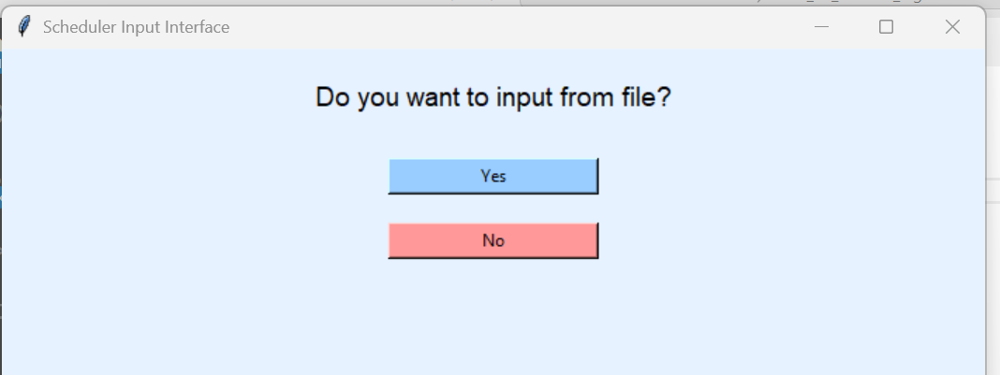*
*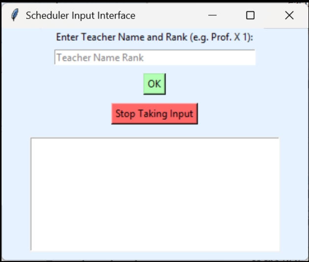*
*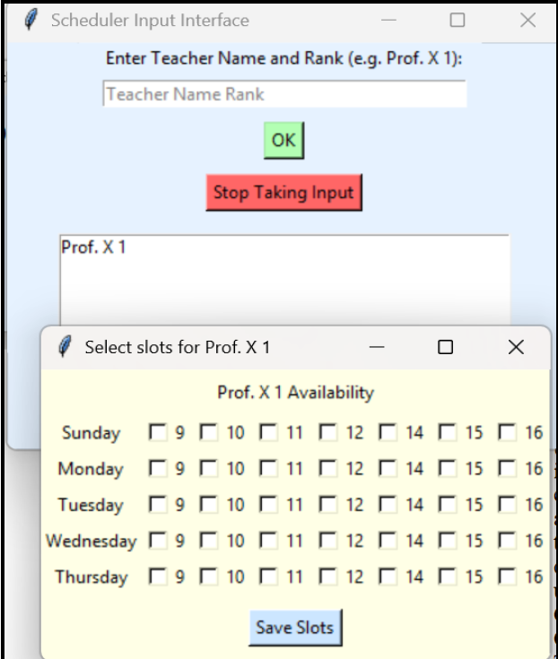*
*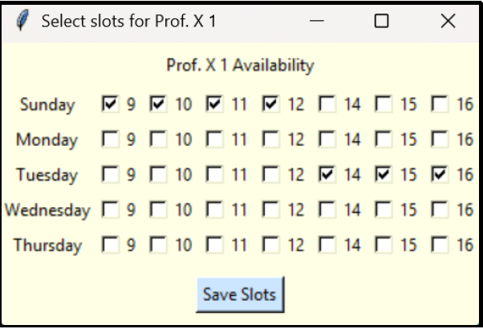*
*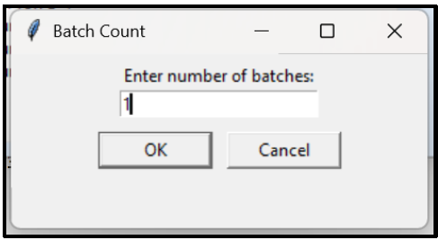*
*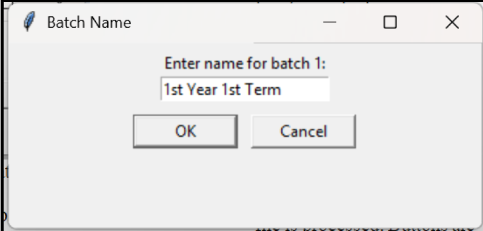*
*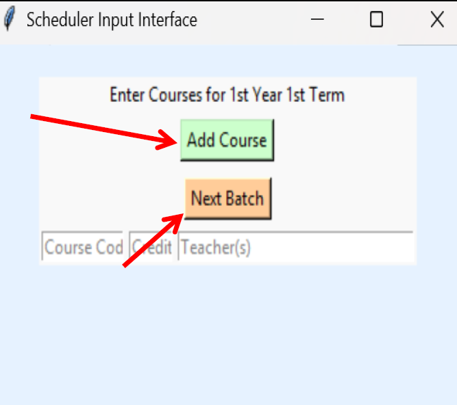*
*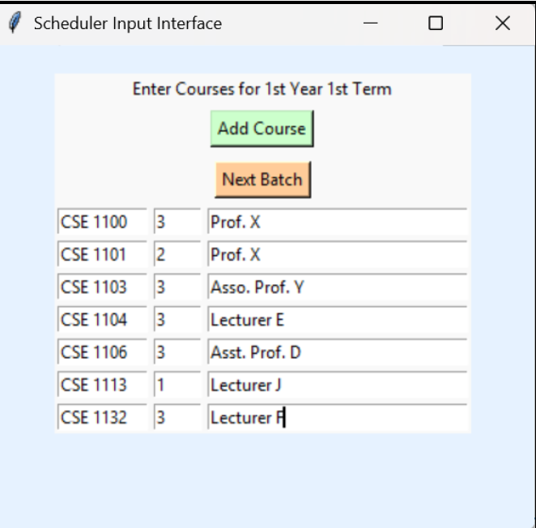*
*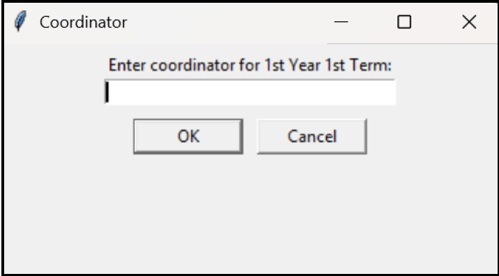*
*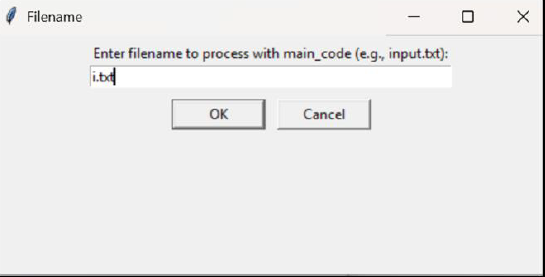*
*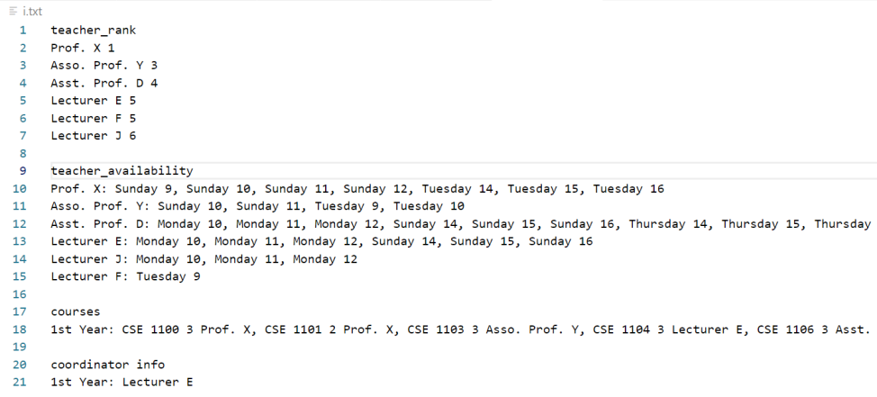*
*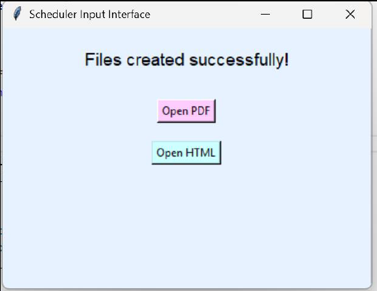*
*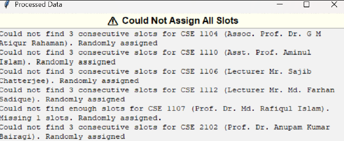*
*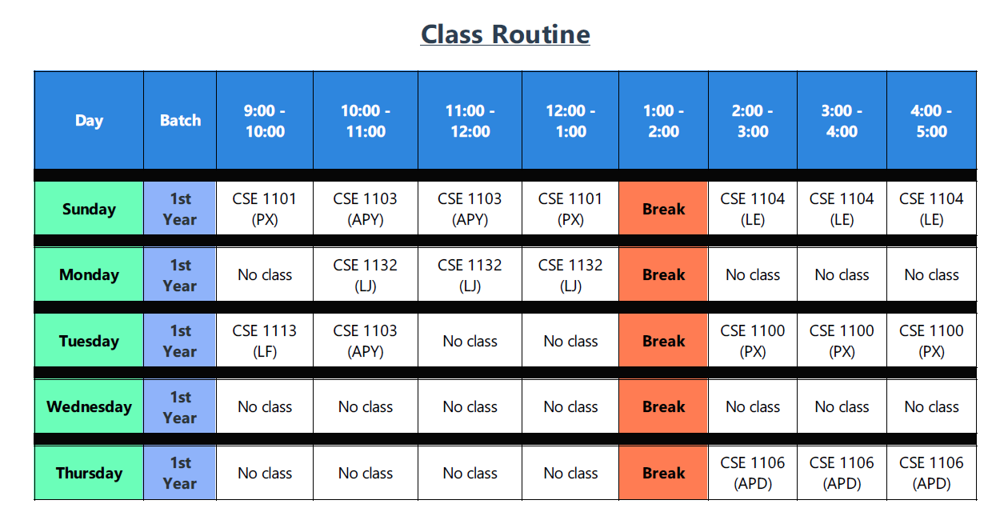*
*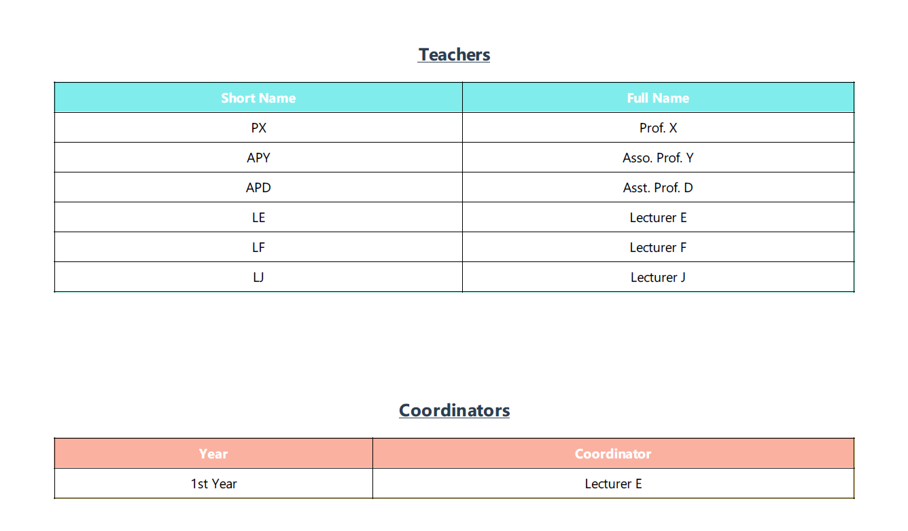*
---

## 🚀 Run the Application

```bash
python main.py
